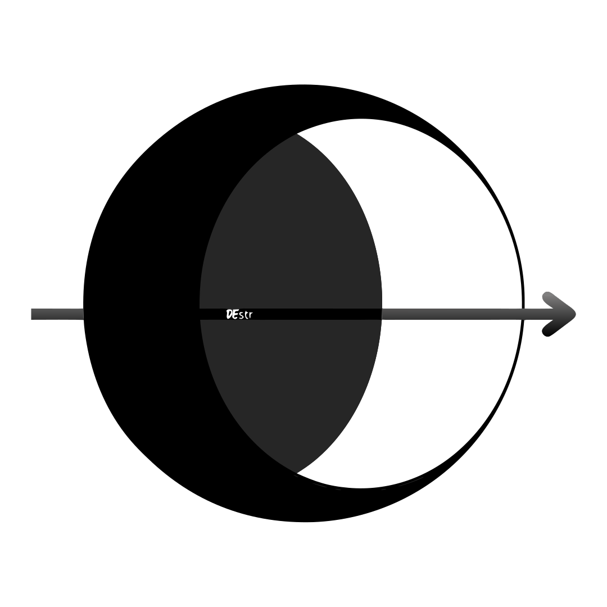

<p align="center">
  
</p>

<h1 align="center">Destr</h1>

<p align="center">
  Modular, production-ready AI knowledge agent built with Clean Architecture on Next.js 16, Vercel AI SDK v6, Drizzle ORM, and Neon Postgres with pgvector.
</p>

<p align="center">
  <a href="#quick-start">Quick Start</a> •
  <a href="#modular-architecture">Architecture</a> •
  <a href="#quality-gates--testing">Quality Gates</a> •
  <a href="#cli--scripts">CLI & Scripts</a> •
  <a href="docs/REFERENCE.md">Technical Reference</a> •
  <a href="CONTRIBUTING.md">Contributing</a>
</p>

---
[](https://github.com/tanmay442/rag_agent/actions/workflows/ci.yml)

## Overview

**Destr** is an enterprise-grade RAG knowledge agent featuring tool-calling chat, hybrid vector + lexical search, grounded citation tracking, agentic retrieval fallback, and real-time administrative telemetry.

---

## Quick Start

### 1. Clone & Start Local Database
```bash
git clone https://github.com/tanmay442/rag_agent.git
cd rag_agent

# Start local Postgres + pgvector container
docker compose up -d db
pnpm install
```

### 2. Configure Environment
Copy `.env.example` to `.env.local` and add your Clerk credentials:
```bash
cp .env.example .env.local
```

### 3. Initialize & Run
```bash
# Push database schema & start development server
pnpm db:push
pnpm dev
```
Open [http://localhost:3000](http://localhost:3000). The default setup boots against local Docker Postgres and Ollama with zero external LLM API keys required.

---

## Modular Architecture

The application is structured as a **4-layer monorepo** with strict Clean Architecture dependency boundaries enforced by `dependency-cruiser`:

```
packages/
├── domain/         # Pure types, Zod schemas, Result<T,E>, port interfaces (no external deps)
├── application/    # Pure use-cases (chat turns, RAG ingest, tickets) returning Result<T, DomainError>
├── infrastructure/ # Drizzle ORM repos, AI SDK adapters, PDF parsers, port implementations
└── cli/            # `rag-agent` CLI management utilities (init, setup, seed, db-migrate)
src/                # Next.js App Router shell, UI components, and single composition root
```

- **Dependency Inversion**: Use-cases depend exclusively on abstract port interfaces in `@app/domain`.
- **Contract-Tested Ports**: All multi-implementation ports (`RateLimiter`, `AnswerCache`, `IngestQueue`, `BlobStorage`, `EmbeddingService`, `Reranker`) share automated contract assertion suites.
- **Composition Root**: Infrastructure adapters are instantiated and wired via a centralized singleton factory (`buildCoreDeps()`) in `src/composition.ts`.

> For complete details on port designs, import boundaries, auth mechanics, and admin features, see the [Technical Reference Manual](docs/REFERENCE.md).

---

## Quality Gates & Testing

Every commit and pull request is validated through automated quality gates:

```bash
# Run full quality gate: Vitest (1,100+ tests) + Typecheck + ESLint + Architecture Rules
pnpm gate

# Run quality gate + Next.js production build:
pnpm gate:build
```

### Verification Metrics
- **127 Test Files**: 123 passed, 4 skipped (live-DB gated).
- **1,113 Total Tests**: 1,055 passed, 58 skipped.
- **495 Architecture Modules**: 1,261 dependencies checked with **0 violations** (`pnpm arch`).

See [docs/test.md](docs/test.md) for full contract matrix and test suite details.

---

## CLI & Scripts

```bash
# Run interactive setup wizard
pnpm configure

# Command-line dispatcher
pnpm cli --help

# Ingest document directory
pnpm cli seed

# Preview chunking strategies across a PDF
pnpm chunks:preview path/to/document.pdf
```

| Script | Purpose |
|---|---|
| `pnpm dev` | Start Next.js development server |
| `pnpm build` | Run local database migrations, then the production build |
| `pnpm gate` | Run full quality gate (`test` + `typecheck` + `lint` + `arch`) |
| `pnpm gate:build` | Run quality gate and production build validation |
| `pnpm db:push` | Push schema changes directly to local database |
| `pnpm db:migrate` | Execute pending Drizzle SQL migrations |
| `pnpm eval` | Run RAG evaluation harness over golden dataset |

Production migrations are not run by Vercel or the Docker build. The gated
`deploy` job in `.github/workflows/ci.yml` runs them with
`MIGRATION_DATABASE_URL`; keep the runtime `DATABASE_URL` on the least-
privilege app role. For Docker builds, pass the public client values explicitly:
`--build-arg NEXT_PUBLIC_CLERK_PUBLISHABLE_KEY=... --build-arg NEXT_PUBLIC_APP_URL=...`.

For multi-instance deployments, configure Upstash Redis for shared rate limits
and answer-cache state. The chat endpoint allows two in-flight streams per
process, so this is not a distributed concurrency limit.

---

## Documentation Index

- [Technical Reference Manual](docs/REFERENCE.md) — Comprehensive guide on Tech Stack, Architecture Deep Dive, Auth/RBAC, Admin Console, Database Schema, Rate Limiting, and Telemetry.
- [Test Suite & Metrics](docs/test.md) — Test catalog, metrics, port contract matrix, and CI pipeline setup.
- [Getting Your API Keys](docs/GETTING_YOUR_API_KEYS.md) — Step-by-step provider credential setup guide.
- [Contributing Guide](CONTRIBUTING.md) — Issue-first workflow, architecture boundary rules, and PR checklist.
