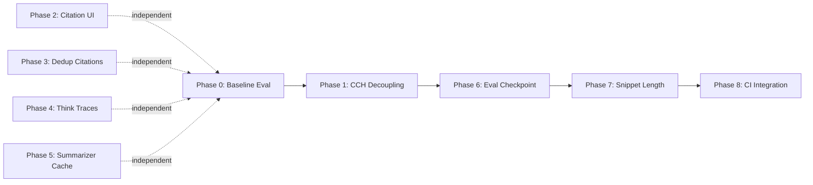

# Citation & Retrieval Quality Audit — Findings & Plan (v2)

> **Supersedes:** [`citation-audit-findings.md`](./citation-audit-findings.md) (v1).
> v1 findings are accurate but incomplete — this v2 adds missing retrieval paths, the full chunking strategy inventory, evaluation gates, efficiency improvements, and a corrected architecture.

---

## 1. How Citations Work (Full Architecture)

### 1.1 Retrieval Paths

v1 described two paths but omitted **hybrid search** (BM25 + RRF), which is enabled by default and is a significant retrieval signal. The corrected architecture:

```
user message
    │
    ├── normal:   query → embed ──→ vector search (pgvector cosine) ─┐
    │                    └──────→ BM25 lexical search (ts_rank) ──────┤── RRF merge
    │                                                                 ▼
    │                                                           reranker (cosine|local|cohere)
    │                                                                 │
    │                                                           parent/window resolution
    │                                                                 │
    │                                                           RetrievedChunk[]
    │
    └── agentic:  query → LLM rewrite ──→ same retrieval pipeline ──→ LLM grade (filter-only)
                                                                          │
                                                                     retry with original query if 0 kept
                                                                          │
                                                                     out-of-domain check (sim < 0.3)
                                                                          │
                                                                     RetrievedChunk[]
                                                                          │
                                                        (post-generation) hallucination grader → guardrail stream
```

Both paths converge on identical citation logic:

```
RetrievedChunk[] → emitCitations(matches) → capturedCitations[]
                                                    │
                                              LLM stream ends
                                                    │
                                              inject data-citation chunks → client renders cards
```

### 1.2 Citation Emission

- `emitCitations()` at [`route.ts:15-30`](../src/app/api/chat/route.ts) takes every `RetrievedChunk` and truncates its `content` to **150 characters** (`CITATION_SNIPPET_MAX`). That truncated text is the user-visible citation snippet.
- The LLM sees **800 characters** per chunk (`TOOL_CONTENT_CAP`). The two truncations are independent — the user's citation is a sub-slice of what the LLM saw, not LLM-generated text.
- In `parent` mode, `resolveParents` ([`search.ts:63-101`](../packages/application/src/rag/search.ts)) substitutes the parent chunk's content (1800 chars) before citation emission. The citation snippet is the first 150 chars of the **parent content**, not the child.
- `fileName`, `page`, `sectionTitle`, `source` are carried through the pipeline but **never rendered** in the citation cards ([`ChatInterface.tsx:196-231`](../src/components/ChatInterface.tsx) only uses `snippet` and `similarity`).
- Blockquote citations in the LLM's markdown answer (e.g. `> "file: text"`) are a prompt guideline only — not enforced, and separate from the auto-generated cards.

### 1.3 Runtime Telemetry (Already Collected)

Per-turn metrics are already tracked at [`route.ts:32-39`](../src/app/api/chat/route.ts):

| Metric | Description |
|---|---|
| `retrieveMs` | Retrieval latency |
| `hitCount` | Number of chunks retrieved |
| `maxSimilarity` | Highest cosine similarity score |
| `rewritten` | Whether query was rewritten (agentic) |
| `ticketCreated` | Whether a support ticket was opened |

These are persisted via `chatEventBatcher` and can be leveraged for monitoring the impact of changes in this plan.

---

## 2. Problems Identified

### 2.1 Primary: CCH Header Dominates Citation Snippets

**Files:** [`ingest.ts:64-95`](../packages/application/src/rag/ingest.ts), [`doc-summarizer.ts`](../packages/infrastructure/src/llm/doc-summarizer.ts), [`constants.ts:15`](../packages/domain/src/constants.ts)

During ingest, when `CCH_ENABLED` (default `true`), every chunk gets this **prepended** to its `content`:

```
Document: <LLM-generated-title>
Summary: <LLM-generated-summary>

<original chunk content>
```

The title and summary are generated by a **separate LLM call** (`doc-summarizer.ts`). Since `emitCitations` shows the **first 150 characters** of content, and the CCH header alone is ~60–150 characters, **every citation snippet is dominated by LLM-generated metadata text**, not the actual document content.

**Additional impact on embeddings:** The same CCH header is shared across all chunks from the same document. For a 400-char child chunk with a 100-char CCH prefix, ~20% of the embedding input is a shared boilerplate prefix. This biases chunk vectors toward each other, reducing intra-document differentiation.

**Note:** The `title` and `summary` are _also_ stamped as separate metadata fields on the `DocumentChunk` ([`ingest.ts:92-93`](../packages/application/src/rag/ingest.ts)), making the content prepending redundant — the data already exists in structured form.

### 2.2 Secondary: `stripThinkTraces` Is Narrow

**File:** [`sanitize-think.ts`](../packages/domain/src/sanitize-think.ts)

Current regex: `/<\s*think\s*>[\s\S]*?<\/\s*think\s*>/gi`

Only strips `<think>...</think>` tags. Misses:
- `[thinking]...[/thinking]`
- `<antThinking>...</antThinking>`
- `<reasoning>...</reasoning>`
- `<scratchpad>...</scratchpad>`
- `<thought>...</thought>`
- Unclosed `<think>` tags (if a chunk boundary splits mid-tag)

### 2.3 Tertiary: Prefetch Can Duplicate Citations

**File:** [`route.ts:288-290`](../src/app/api/chat/route.ts) vs [`route.ts:108-110`](../src/app/api/chat/route.ts)

When `prefetchFirstTurn` is enabled, the same chunks can be added to `capturedCitations` twice (once at prefetch, once when the tool retrieves them). There is **no deduplication** — all items in `capturedCitations` are streamed directly to the client at [`route.ts:326-330`](../src/app/api/chat/route.ts).

### 2.4 Metadata Not Rendered in Citation Cards (NEW)

**File:** [`ChatInterface.tsx:196-231`](../src/components/ChatInterface.tsx)

The citation object carries `fileName`, `page`, `sectionTitle`, and `source` ([`types.ts`](../src/chat/types.ts)), but the UI only renders `snippet` and `similarity`. Users see a text snippet with a similarity percentage but have no idea which document or page it came from.

### 2.5 Doc Summarizer Has No Caching (NEW — Efficiency)

**File:** [`doc-summarizer.ts`](../packages/infrastructure/src/llm/doc-summarizer.ts)

The `generateDocContext` call is made on every document during ingest. Re-ingesting unchanged documents re-runs the LLM summarization call, wasting API tokens and adding latency. For a 1000-document corpus, this means ~1000 redundant LLM calls per full re-index.

### 2.6 Evaluation Harness Exists But Is Not Integrated (NEW — Quality)

**Files:** [`scripts/eval/harness.ts`](../scripts/eval/harness.ts), [`scripts/eval/golden.ts`](../scripts/eval/golden.ts), [`scripts/eval/run.ts`](../scripts/eval/run.ts)

An evaluation suite already exists with three metrics:

| Metric | How It's Computed |
|---|---|
| **Faithfulness** | LLM-graded groundedness (`hallucinationGrader`): 1 if supported, 0 if hallucinated |
| **Correctness** | Fraction of expected `mustMention` phrases present in the generated answer |
| **Context Relevancy** | Fraction of `mustMention` phrases present in retrieved context |

**Pass criterion:** `faithfulness === 1 && forbiddenHit.length === 0 && correctness >= 0.5`
**Threshold:** `EVAL_FAITHFULNESS_THRESHOLD = 0.7` (mean faithfulness across test suite)

However, this harness runs only via `pnpm eval` as a standalone script. It is **not integrated into CI/CD** and is not run before/after any of the changes proposed in v1. This means any phase could silently regress retrieval quality.

---

## 3. Full Chunking Strategy Inventory

v1 only discussed CCH and parent-child chunking. The codebase actually has **7 chunking strategies + 1 enrichment layer**. All must be maintained:

| Strategy | File | Default | Description |
|---|---|---|---|
| **Document-Aware** | [`strategies/document-aware.ts`](../packages/infrastructure/src/chunking/strategies/document-aware.ts) | ✅ Enabled | Parses Markdown blocks (headers, lists, tables). Maintains header hierarchy state (H1 > H2) and prepends context breadcrumbs. Splits tables row-by-row preserving header rows. Falls back to sentence-based splitting for oversized blocks. |
| **Parent-Child** | [`strategies/parent-child.ts`](../packages/infrastructure/src/chunking/strategies/parent-child.ts) | ✅ Enabled | Groups sections into parent blocks (~2200 chars, `kind: 'parent'`). Splits parents into child chunks (~700 chars / 400 token cap, `kind: 'child'`). Children are embedded; parents get zero-vector placeholders. At retrieval, child hits resolve to parent content via `resolveParents`. |
| **Recursive-Adaptive** | [`strategies/recursive-adaptive.ts`](../packages/infrastructure/src/chunking/strategies/recursive-adaptive.ts) | ✅ Available | Merges page text, tracks page offsets via `buildPageSpans`. Merges short paragraphs (<200 chars). Splits using LangChain `RecursiveCharacterTextSplitter` with `INGEST_CHUNK_SIZE=800` and `INGEST_CHUNK_OVERLAP=80`. |
| **Semantic** | [`strategies/semantic.ts`](../packages/infrastructure/src/chunking/strategies/semantic.ts) | ❌ Disabled | Embeds every sentence, computes cosine similarity between adjacent sentence vectors. Splits at boundaries where similarity drops below `TOPIC_THRESHOLD=0.3`. Bounded by `MIN_CHUNK=300` and `MAX_CHUNK=600` chars. |
| **Pre-Chunked** | [`strategies/pre-chunked.ts`](../packages/infrastructure/src/chunking/strategies/pre-chunked.ts) | ✅ Available | 1-page-to-1-chunk mapping. Preserves exact input page structure. |
| **Pre-Chunked Markdown** | [`ingest-prechunked.ts`](../packages/application/src/rag/ingest-prechunked.ts) | ✅ Available | Splits at `---chunk---` delimiter lines (respects code fences). Parses per-chunk YAML metadata (`title:`, `page:`, `source:`). |
| **Legacy Splitter** | [`langchain-splitter.ts`](../packages/infrastructure/src/pdf/langchain-splitter.ts) | ⚡ Fallback | Wraps LangChain `RecursiveCharacterTextSplitter`. Used when the new strategy path (`contentParser` + `chunkingStrategy`) is not injected. |
| **CCH (Enrichment)** | [`ingest.ts:64-95`](../packages/application/src/rag/ingest.ts) | ✅ Enabled | Prepends LLM-generated document title + summary to every chunk's `content` field. Applied after chunking, before embedding. |

### Chunk Data Model

The chunk flows through several interfaces during its lifecycle:

```
ParsedChunk → DocumentChunk → PreparedChunk → (DB) → RetrievedChunkRow → RetrievedChunk → Citation
```

**Key fields carried through:**

| Field | Set During | Used For |
|---|---|---|
| `content` | Chunking + CCH | Embedding, citation snippet, LLM tool content |
| `fileName` | Ingest | Provenance (not rendered in UI) |
| `page` | Chunking | Provenance (not rendered in UI) |
| `sectionTitle` | Chunking | Provenance (not rendered in UI) |
| `source` | Ingest | Provenance (not rendered in UI) |
| `title` | CCH (`doc-summarizer`) | Metadata only (also redundantly in `content`) |
| `summary` | CCH (`doc-summarizer`) | Metadata only (also redundantly in `content`) |
| `parentChunkId` | Parent-child splitter | Resolves child to parent at retrieval |
| `kind` | Parent-child splitter | `'parent'`/`'child'`/`'summary'` — parents skip embedding |
| `contentHash` | Ingest | Could be used for dedup/caching (currently unused for caching) |
| `chunkIndex` | Ingest | Window resolution (`± PARENT_CHILD_WINDOW` neighbours) |

---

## 4. Proposed Plan (v2)

### Design Principles

1. **Measure before changing.** Every phase that modifies retrieval quality has a pre/post evaluation gate.
2. **Decouple, don't remove.** CCH data is valuable — separate it from `content` so each consumer (embedding, citation, LLM) can use it independently.
3. **Preserve all chunking strategies.** No strategy should be removed. Each serves a different document type.
4. **Efficiency without quality loss.** Caching, deduplication, and constant tuning should not change retrieval behavior.

### Phase 0: Establish Baseline Metrics

**Goal:** Record ground truth before any changes.

**Files:** [`scripts/eval/harness.ts`](../scripts/eval/harness.ts), [`scripts/eval/run.ts`](../scripts/eval/run.ts)

1. Run `pnpm eval` (or `EVAL_REAL=1 pnpm eval` if real providers are available) to get baseline scores.
2. Record: `meanFaithfulness`, `meanCorrectness`, `meanContextRelevancy`, per-question results.
3. Store results as `docs/eval-baseline.json` for comparison.
4. If the golden dataset ([`scripts/eval/golden.ts`](../scripts/eval/golden.ts)) has fewer than 20 questions, expand it before proceeding — a thin test suite won't catch regressions.

**Risk:** None.
**Quality impact:** 📊 Establishes measurement baseline.

---

### Phase 1: Decouple CCH from Content — Store as Separate Metadata

**Goal:** Fix citation snippets while preserving embedding quality and enabling independent tuning.

**Files:** [`ingest.ts:64-95`](../packages/application/src/rag/ingest.ts), [`route.ts:15-30`](../src/app/api/chat/route.ts)

**Why not v1's Option A (disable CCH)?** Disabling CCH removes the only document-level semantic signal from embedding vectors. Parent-child chunking provides context at retrieval resolution time, not at embedding time. These solve different problems. Removing CCH without measurement could degrade recall for broad document-level queries like "What is this document about?"

**Why not v1's Option B (strip in emitCitations)?** Better than Option A, but CCH still occupies embedding vector capacity and LLM tool content tokens. A structural fix is preferred.

**Implementation:**

1. **Modify `applyCchHeader` in `ingest.ts`:** Stop prepending the header to `content`. Instead, store the header as a separate `embeddingPrefix` field:

   ```typescript
   function applyCchHeader(
     docChunks: DocumentChunk[],
     header: string,
     title: string | null,
     summary: string | null,
   ): DocumentChunk[] {
     return docChunks.map((c) => ({
       ...c,
       content: c.content,                    // clean — no CCH prefix
       embeddingPrefix: header || undefined,   // CCH only for embedding
       title: c.title ?? title,
       summary: c.summary ?? summary,
     }));
   }
   ```

2. **Modify embedding call in `ingest.ts`:** Concatenate `embeddingPrefix + content` only when computing the embedding vector:

   ```typescript
   const embeddingInputs = docChunks.map((c) =>
     c.embeddingPrefix ? c.embeddingPrefix + c.content : c.content
   );
   const embeddings = await deps.embeddings.embedBatch(embeddingInputs);
   ```

3. **`emitCitations()` now automatically clean:** Since `content` no longer contains the CCH prefix, snippets will show actual document text. No changes needed to `emitCitations`.

4. **LLM tool content — add structured metadata:** In the `searchDocumentation` tool handler ([`route.ts:101-107`](../src/app/api/chat/route.ts)), include `title` and `summary` as structured metadata instead of embedded in content:

   ```typescript
   const capped = matches.map((m) => ({
     content: m.content.length > TOOL_CONTENT_CAP
       ? m.content.slice(0, TOOL_CONTENT_CAP) + '\u2026'
       : m.content,
     similarity: m.similarity,
     documentTitle: m.title ?? undefined,     // structured, not embedded in text
     section: m.sectionTitle ?? undefined,
   }));
   ```

**Comparison of approaches:**

| Concern | v1 Option A (disable) | v1 Option B (strip snippet) | v2 (separate fields) ✅ |
|---|---|---|---|
| Embedding quality | ❌ Loses document signal | ⚠️ CCH dilutes embedding | ✅ Clean separation |
| Citation quality | ✅ Fixed | ✅ Fixed | ✅ Fixed |
| LLM context quality | ✅ Clean text | ⚠️ CCH wastes LLM tokens | ✅ Structured metadata |
| Independent tuning | ❌ All or nothing | ❌ Coupled | ✅ Each independently |
| Re-index required? | ✅ Yes | ❌ No | ✅ Yes (one-time) |

**Risk:** Low — requires re-indexing existing documents.
**Quality checkpoint:** Re-run `pnpm eval` after re-index. Compare against Phase 0 baseline. Proceed only if `meanFaithfulness` and `meanContextRelevancy` are within 5% of baseline.

---

### Phase 2: Render Provenance Metadata in Citation Cards

**Goal:** Show users which document, page, and section each citation comes from.

**File:** [`ChatInterface.tsx:196-231`](../src/components/ChatInterface.tsx)

The citation object already carries `fileName`, `page`, `sectionTitle`, and `source` — none are rendered. Add them:

```
┌──────────────────────────────────────┐
│ Source 1                      [92%]  │
│ 📄 employee-benefits.pdf — p.5      │
│ § Dental Coverage                    │
│                                      │
│ Two cleanings per year are           │
│ covered under the dental plan.       │
└──────────────────────────────────────┘
```

Display rules:
- Show `fileName` always (it's the most important provenance signal).
- Show `page` if present (PDFs have pages, Markdown may not).
- Show `sectionTitle` if present and distinct from `fileName`.
- Omit `source` from the card (it's the blob URL, useful for linking but not display).

**Risk:** None — purely additive UI change.
**Quality impact:** ✅ Better provenance transparency.

---

### Phase 3: Deduplicate Citations

**Goal:** Prevent duplicate citation cards from prefetch + tool retrieval.

**File:** [`route.ts`](../src/app/api/chat/route.ts)

Deduplicate `capturedCitations` by chunk identity **before** emitting at [`route.ts:326-330`](../src/app/api/chat/route.ts). Use a composite key of `fileName + page + snippet prefix` rather than content hashing:

```typescript
// Before streaming citations
const seen = new Set<string>();
const deduped = capturedCitations.filter((c) => {
  const key = `${c.fileName ?? ''}:${c.page ?? ''}:${c.snippet.slice(0, 60)}`;
  if (seen.has(key)) return false;
  seen.add(key);
  return true;
});

for (const src of deduped) {
  controller.enqueue({ type: 'data-citation', data: src });
}
```

**Why not chunk ID?** The `emitCitations` output doesn't carry the chunk `id` (it's stripped in the mapping at [`route.ts:18-29`](../src/app/api/chat/route.ts)). Adding the ID would require changing the citation type. The snippet prefix approach is pragmatic and sufficient — identical file + page + first 60 chars of snippet is a reliable identity.

**Risk:** None.
**Quality impact:** ✅ Cleaner UX, no duplicate cards.

---

### Phase 4: Widen `stripThinkTraces`

**Goal:** Strip all common reasoning-tag formats from content.

**File:** [`sanitize-think.ts`](../packages/domain/src/sanitize-think.ts)

Replace the single regex with a comprehensive pattern:

```typescript
const THINK_PATTERNS = [
  /<\s*think\s*>[\s\S]*?<\/\s*think\s*>/gi,
  /<\s*thought\s*>[\s\S]*?<\/\s*thought\s*>/gi,
  /<antThinking>[\s\S]*?<\/antThinking>/gi,
  /<\s*reasoning\s*>[\s\S]*?<\/\s*reasoning\s*>/gi,
  /<\s*scratchpad\s*>[\s\S]*?<\/\s*scratchpad\s*>/gi,
  /\[\s*thinking\s*\][\s\S]*?\[\s*\/\s*thinking\s*\]/gi,
];

export function stripThinkTraces(input: string): string {
  let result = input;
  for (const re of THINK_PATTERNS) {
    result = result.replace(re, '');
  }
  return result.replace(/\n{3,}/g, '\n\n').trim();
}
```

Using an array of patterns instead of one combined regex for:
- Readability — each pattern is self-documenting.
- Maintainability — new patterns can be added without modifying a complex alternation.
- Debuggability — individual patterns can be tested/disabled.

**Risk:** None — additive sanitization.
**Quality impact:** ✅ Edge case fix for documents containing reasoning traces.

---

### Phase 5: Add Doc Summarizer Caching

**Goal:** Eliminate redundant LLM calls when re-ingesting unchanged documents.

**File:** [`doc-summarizer.ts`](../packages/infrastructure/src/llm/doc-summarizer.ts)

The `generateDocContext` function is called on every document during ingest. The `contentHash` field already exists on `DocumentChunk` but is not used for CCH caching.

**Implementation:**

1. Before calling the LLM, compute a hash of the input text (first `CCH_CONTEXT_CHARS` characters).
2. Check if a cached result exists for that hash (use a simple in-memory Map during a single ingest run, or a DB lookup for cross-run persistence).
3. If cached, return the cached `{ title, summary }`.
4. If not cached, call the LLM and store the result.

```typescript
const cchCache = new Map<string, { title: string; summary: string }>();

async function generateDocContext(text: string): Promise<{ title: string; summary: string }> {
  const key = createHash('sha256').update(text.slice(0, CCH_CONTEXT_CHARS)).digest('hex');
  const cached = cchCache.get(key);
  if (cached) return cached;

  const result = await callLlm(text);  // existing LLM call
  cchCache.set(key, result);
  return result;
}
```

**Estimated savings:** For a 1000-doc corpus, saves ~1000 LLM API calls per re-index when documents haven't changed.

**Risk:** None — caching doesn't change output, only skips redundant computation.
**Quality impact:** ⚡ Efficiency win. No retrieval behavior change.

---

### Phase 6: Re-Run Evaluation — Quality Checkpoint

**Goal:** Validate that Phases 1–5 have not regressed retrieval quality.

**Files:** [`scripts/eval/harness.ts`](../scripts/eval/harness.ts), [`scripts/eval/run.ts`](../scripts/eval/run.ts)

1. Run `pnpm eval` with the same dataset used in Phase 0.
2. Compare: `meanFaithfulness`, `meanCorrectness`, `meanContextRelevancy`.
3. **Gate:** If any metric regresses > 5% from baseline, investigate before proceeding.
4. Store results as `docs/eval-post-v2.json`.

**Specific things to check:**
- Did CCH decoupling (Phase 1) change `meanContextRelevancy`? If it dropped, the embedding prefix may need tuning.
- Did any per-question `correctness` drop to 0? This could indicate a specific document type that relied heavily on CCH.

---

### Phase 7: Tune Citation Snippet Length

**Goal:** Now that CCH is decoupled, the full snippet is actual document content. Evaluate whether 150 chars is sufficient.

**File:** [`constants.ts:18`](../packages/domain/src/constants.ts)

After Phase 1, the 150-char snippet will contain only document text (no CCH prefix). This may be sufficient, or it may be worth increasing to 250–300 chars for richer provenance — especially since parent chunks (1800 chars) have plenty of content.

**Implementation:** Change `CITATION_SNIPPET_MAX` from `150` to the desired value. This is a constants-only change.

**Decision criteria:**
- If typical snippets feel truncated mid-sentence after Phase 1, increase to 250.
- If snippets are already meaningful at 150 chars, keep the current value (fewer bytes streamed to client).

**Risk:** Low — UI-only change.
**Quality impact:** ✅ Richer citation context if increased.

---

### Phase 8: Integrate Evaluation into CI (Optional — Long-Term)

**Goal:** Prevent future regressions by gating deployments on evaluation scores.

**Files:** [`scripts/eval/run.ts`](../scripts/eval/run.ts), CI config

1. Add `pnpm eval` as a CI step that runs on PRs touching `packages/application/src/rag/` or `packages/infrastructure/src/chunking/`.
2. Use mock mode (`EVAL_REAL=0`, the default) for fast CI runs — deterministic, no network/DB.
3. Use real mode (`EVAL_REAL=1`) as a manual job for validating significant retrieval changes.
4. Fail the CI job if `meanFaithfulness < EVAL_FAITHFULNESS_THRESHOLD` (currently `0.7`).

**Risk:** None — additive CI change.
**Quality impact:** 🛡️ Long-term regression prevention.

---

## 5. Phase Dependencies & Parallelism



**Parallel work:** Phases 2, 3, 4, 5 are fully independent of each other and of Phase 1. They can be done in any order or in parallel.

**Sequential gates:** Phase 0 → Phase 1 → Phase 6 → Phase 7 → Phase 8. Each requires the previous to complete.

---

## 6. Key Constants Reference (Complete)

### Ingest & Chunking

| Constant | File | Line | Default | Description |
|---|---|---|---|---|
| `CCH_ENABLED` | `constants.ts` | 15 | `true` | Toggles CCH header prepending |
| `CCH_MODEL` | `constants.ts` | 16 | `''` (uses default) | Override model for CCH summarizer |
| `CCH_CONTEXT_CHARS` | `constants.ts` | 17 | `4000` | Chars of document fed to CCH summarizer |
| `INGEST_CHUNK_SIZE` | `constants.ts` | 26 | `800` | Base chunk size for legacy/recursive splitters |
| `INGEST_CHUNK_OVERLAP` | `constants.ts` | 27 | `80` (`INGEST_CHUNK_SIZE / 10`) | Overlap between adjacent chunks |
| `PARENT_CHUNK_SIZE` | `constants.ts` | 28 | `1800` | Parent chunk size |
| `CHILD_CHUNK_SIZE` | `constants.ts` | 29 | `400` | Child chunk size |
| `PARENT_CHILD_MODE` | `constants.ts` | 30 | `'parent'` | Resolution mode: `'parent'` or `'window'` |
| `PARENT_CHILD_WINDOW` | `constants.ts` | 31 | `2` | ±N neighbour chunks in `'window'` mode |
| `MD_CHUNK_DELIMITER` | `constants.ts` | 20 | `'---chunk---'` | Delimiter for pre-chunked Markdown |
| `EMBEDDING_BATCH_SIZE` | `constants.ts` | 22 | `50` | Chunks per embedding API call |
| `EMBEDDING_BATCH_CONCURRENCY` | `constants.ts` | 21 | `3` | Concurrent embedding batches |

### Retrieval & Reranking

| Constant | File | Line | Default | Description |
|---|---|---|---|---|
| `HYBRID_ENABLED` | `constants.ts` | 39 | `true` | Enables BM25 + vector hybrid search |
| `RRF_K` | `constants.ts` | 40 | `60` | RRF smoothing constant |
| `LEXICAL_WEIGHT` | `constants.ts` | 41 | `1` | BM25 boost weight in RRF fusion |
| `SIMILARITY_THRESHOLD` | `constants.ts` | 42 | `0.5` | Minimum cosine similarity (skipped when reranker active) |
| `CANDIDATE_POOL` | `constants.ts` | 35 | `30` | Broad pool size before reranking |
| `RERANKER_PROVIDER` | `constants.ts` | 34 | `'cosine'` | Provider: `'cosine'`, `'local'`, or `'cohere'` |
| `RERANK_TOP_N` | `constants.ts` | 36 | `3` (`DEFAULT_SEARCH_LIMIT`) | Final top-N after reranking |

### Citation & LLM

| Constant | File | Line | Default | Description |
|---|---|---|---|---|
| `CITATION_SNIPPET_MAX` | `constants.ts` | 18 | `150` | Max chars in citation snippet |
| `TOOL_CONTENT_CAP` | `constants.ts` | 43 | `800` | Max chars per chunk returned to LLM |

### Agentic

| Constant | File | Line | Default | Description |
|---|---|---|---|---|
| `AGENTIC_ENABLED` | `constants.ts` | 44 | `true` | Enables agentic retrieval mode |
| `GRADE_MODEL` | `constants.ts` | 45 | `''` (uses default) | Override model for document grading |
| `OUT_OF_DOMAIN_THRESHOLD` | `constants.ts` | 46 | `0.3` | Similarity below which query is flagged out-of-domain |
| `AGENT_STEP_BUDGET` | `constants.ts` | 47 | `8` | Max LLM tool-calling steps in agentic mode |
| `AGENTIC_RETRIEVE_LIMIT` | `constants.ts` | 49 | `10` | Candidate pool for agentic re-retrieval |
| `AGENTIC_MAX_RETRIES` | `constants.ts` | 51 | `1` | Max rewrite+retry passes before fallback |

### Caching & Evaluation

| Constant | File | Line | Default | Description |
|---|---|---|---|---|
| `ANSWER_CACHE_ENABLED` | `constants.ts` | 53 | `true` | Enables answer caching |
| `ANSWER_CACHE_TTL_SEC` | `constants.ts` | 54 | `3600` | Cache TTL in seconds |
| `EVAL_FAITHFULNESS_THRESHOLD` | `constants.ts` | 58 | `0.7` | CI gate — fail when mean faithfulness drops below |
| `TRACE_ENABLED` | `constants.ts` | 56 | `false` | Emit structured logger spans |
